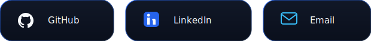
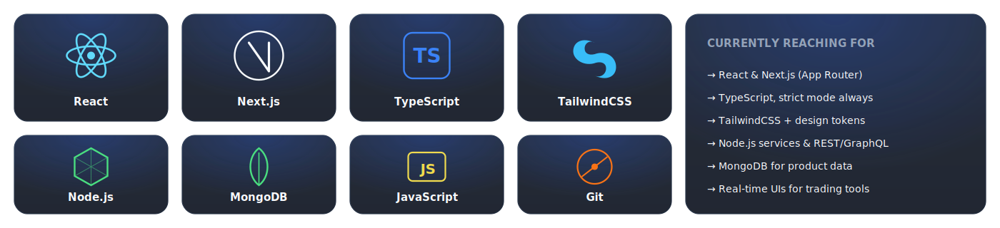

<div align="center">



<br/>

<a href="#about">About</a> ·
<a href="#focus">Current&nbsp;Focus</a> ·
<a href="#stack">Tech&nbsp;Stack</a> ·
<a href="#projects">Projects</a> ·
<a href="#stats">Stats</a> ·
<a href="#philosophy">Philosophy</a> ·
<a href="#contact">Contact</a>

<br/><br/>

<a href="https://github.com/AmirGhl"></a>

</div>

<br/>


<br/>

<h2 id="about" align="center">About</h2>

<table align="center">
<tr>
<td width="220" align="center" valign="top">

</td>
<td width="620" valign="top">
<br/>

I'm a frontend engineer who builds interfaces where **precision matters** — dense data, real-time updates, and split-second decisions, without ever feeling cluttered.

Most of my work lives at the intersection of **UI engineering** and **FinTech**: trading dashboards, market data, and social platforms for traders, built with React, Next.js and TypeScript.

I care about the details most people skip — the 60fps scroll, the layout that never shifts, the loading state that respects your time.

</td>
</tr>
</table>

<br/>


<br/>

<h2 id="focus" align="center">Current Focus</h2>

<div align="center">

| | |
|:---|:---|
| 🎯 | Building **Traders Royal** — a social trading platform for the modern trader |
| ⚡ | Optimizing real-time UI performance for high-frequency market data |
| 🧩 | Designing a reusable, accessible React component system |
| 📈 | Exploring the edges of React Server Components in production |

</div>

<br/>


<br/>

<h2 id="stack" align="center">Tech Stack</h2>

<div align="center">

</div>

<br/>



<br/>

<h2 id="projects" align="center">Featured Projects</h2>

<div align="center">

</div>

<div align="center">
<sub><a href="https://github.com/AmirGhl">→ See all repositories on GitHub</a></sub>
</div>

<br/>


<br/>

<h2 id="stats" align="center">GitHub Stats</h2>

<div align="center">


<br/>

<h3>Top Languages</h3>


</div>

<br/>

<h3 align="center">Contribution Graph</h3>

<div align="center">

</div>

<br/>

<h3 align="center">Snake</h3>

<div align="center">

<picture>
  <source media="(prefers-color-scheme: dark)" srcset="https://raw.githubusercontent.com/AmirGhl/AmirGhl/output/snake-dark.svg" />
  <source media="(prefers-color-scheme: light)" srcset="https://raw.githubusercontent.com/AmirGhl/AmirGhl/output/snake-light.svg" />
  
</picture>

</div>

<br/>


<br/>

<h2 align="center">Timeline</h2>

<div align="center">

```
2026  →  Building Traders Royal, a social trading platform
2025  →  Deepened focus on FinTech UI and real-time systems
2024  →  Shipped production apps with Next.js App Router
2023  →  Specialized in React, TypeScript & design systems
       →  Started as a Frontend Engineer
```

</div>

<br/>

<h2 id="philosophy" align="center">Developer Philosophy</h2>

<div align="center">

<table>
<tr>
<td align="center" width="240">

**Clarity over cleverness**
<br/><sub>Code should read like it explains itself.</sub>

</td>
<td align="center" width="240">

**Performance is UX**
<br/><sub>A fast interface is a form of respect.</sub>

</td>
<td align="center" width="240">

**Systems, not one-offs**
<br/><sub>Build the pattern once, reuse it well.</sub>

</td>
</tr>
</table>

</div>

<br/>


<br/>

<h2 align="center">Open Source</h2>

<div align="center">

I contribute to and maintain small, focused tools — component kits, dashboard utilities, and developer-experience improvements for React and Next.js projects.

<br/>

<sub>Have a project we could build on together? <a href="mailto:amirghlw@gmail.com">Let's talk</a>.</sub>

</div>

<br/>


<br/>

<h2 id="contact" align="center">Contact</h2>

<div align="center">
<a href="https://github.com/AmirGhl"></a>
</div>

<br/>

<div align="center">

</div>

